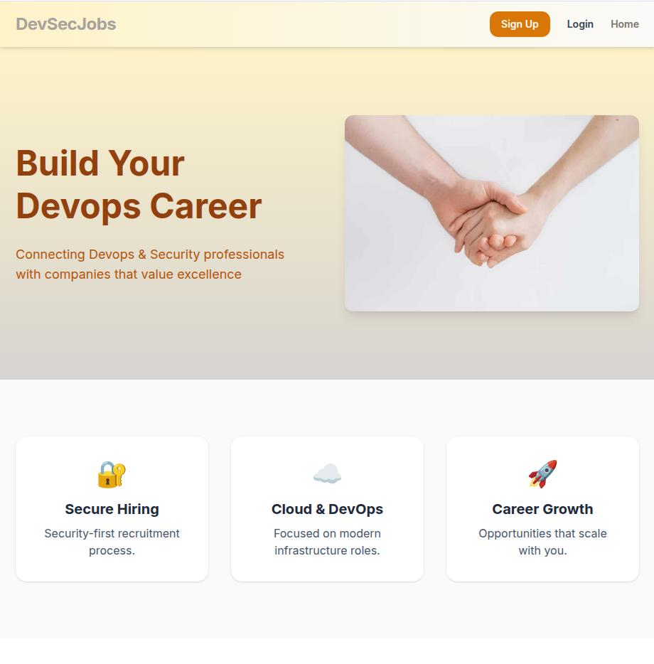
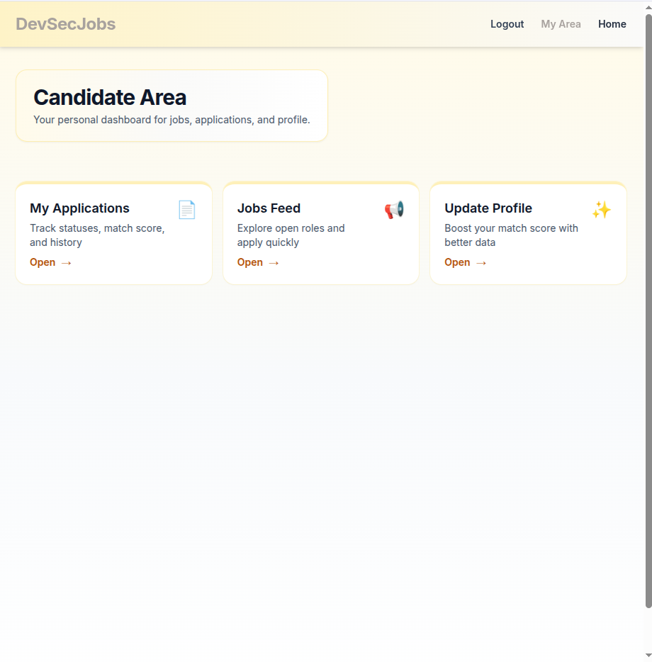
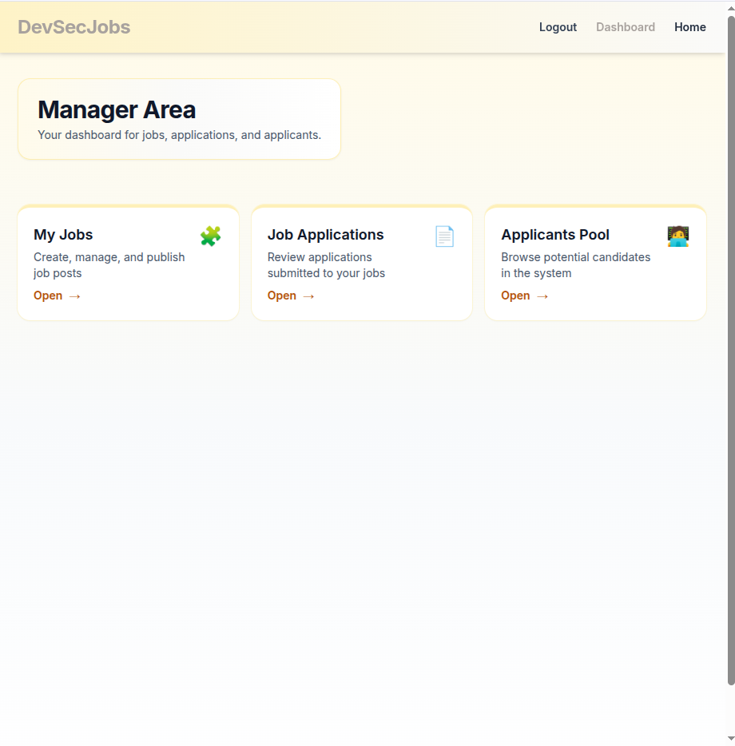

# DevSecJobs — Cloud-Native DevOps Recruitment Platform

DevSecJobs is a production-style full-stack recruitment platform
designed specifically for **DevOps, Cloud, and Security professionals**.

This project demonstrates real-world DevOps practices including secure
CI/CD, Infrastructure as Code, dynamic secret provisioning, container
orchestration, and cloud-native deployment.

------------------------------------------------------------------------

## Live Demo

**Public Deployment:**\
http://3.85.124.172/

Deployed on AWS EC2 using Docker Compose with secure CI/CD automation.

------------------------------------------------------------------------

## Platform Overview

DevSecJobs is a role-based recruitment system.

### Candidate Area

-   Build and manage professional profile
-   Browse job feed
-   Apply to positions
-   Track match score and application status

### Manager Area

-   Create and manage job postings
-   Review job applications
-   Browse candidate pool
-   Evaluate match scores

------------------------------------------------------------------------

## Tech Stack

### Frontend

-   React (Vite)
-   TailwindCSS
-   JWT-based authentication
-   Role-based routing

### Backend

-   Flask (Python)
-   REST API architecture
-   JWT authentication & authorization
-   MySQL integration

### Database

-   MySQL (containerized)

### Containerization

-   Docker
-   Docker Compose

### Cloud & DevOps

-   AWS EC2
-   Amazon ECR
-   AWS SSM Parameter Store
-   GitHub Actions (CI/CD)
-   OIDC Federation (No static AWS keys)
-   Terraform (Infrastructure as Code)
-   Remote Terraform backend (S3 + state locking)

------------------------------------------------------------------------

## Security Architecture

### OIDC Instead of Static AWS Credentials

GitHub Actions assumes an IAM role via OIDC.\
No AWS access keys are stored in the repository or GitHub Secrets.

### Dynamic Secret Provisioning

Secrets such as: - JWT secret - Database credentials - Environment
configuration

are stored in AWS SSM Parameter Store and dynamically injected at
runtime via EC2 user-data.

No hardcoded secrets exist in the repository.

### Temporary CI/CD SSH Access

During deployment:
 1. GitHub runner IP is detected.
 2. Temporarily allowed in the EC2 Security Group.
 3. Revoked after deployment

------------------------------------------------------------------------

## CI/CD Workflow

### Build & Push

-   Builds frontend and backend Docker images
-   Tags images with commit SHA + latest
-   Pushes to Amazon ECR

### Auto Update on Push

-   Detects which directory changed
-   Builds only changed service
-   Pushes new image
-   SSH into EC2
-   Pulls updated container
-   Recreates service
-   Revokes temporary SSH rule

All deployments are traceable via commit SHA tagging.

------------------------------------------------------------------------

## Infrastructure Design

Infrastructure is fully parameterized via Terraform.

### Key Principles

-   No hardcoded AWS account values
-   Environment-agnostic deployment
-   Reusable infrastructure modules
-   Remote Terraform state for safety

------------------------------------------------------------------------

## Architecture Flow

    Developer Push
          ↓
    GitHub Actions
          ↓
    OIDC → Assume IAM Role
          ↓
    Build Docker Images
          ↓
    Push to Amazon ECR
          ↓
    SSH to EC2
          ↓
    docker compose pull
          ↓
    docker compose up -d

------------------------------------------------------------------------

## Application-UI

### Landing Page

### Candidate Dashboard

### Manager Dashboard

------------------------------------------------------------------------

## Design Decisions

-   Docker Compose chosen for simplicity and clarity
-   OIDC for secure GitHub integration
-   SSM for dynamic secret handling
-   Remote Terraform backend for state management
-   Parameterized infrastructure for portability
-   SHA-based image tagging for reproducible deployments

------------------------------------------------------------------------

## Quick Start - Manual Deployment Guide

This section allows a new user to deploy the full infrastructure and application with minimal effort.

### 1. Deploy Terraform Remote Backend (One-Time)

cd tf-state-backend  
terraform init  
terraform apply  

---

### 2. Deploy Infrastructure

cd ../tf  
cp secrets.tfvars.example secrets.auto.tfvars  

Edit `secrets.auto.tfvars` and fill in:

- account_id  
- key_pair_name  
- admin_cidr (YOUR_PUBLIC_IP/32)  
- mysql_password  
- mysql_root_password  

Then run:

chmod +x init.sh  
./init.sh  

terraform init  
terraform apply  

This provisions:

- EC2 instance  
- IAM roles  
- OIDC trust for GitHub  
- Amazon ECR repositories  
- SSM Parameter Store secrets  
- Security Groups

After deployment completes, note the EC2 public IP from the Terraform output.

---

### 3. Configure GitHub Repository Variables

Add the following **Repository Variables**:

- AWS_REGION  
- ACCOUNT_ID  
- FE_REPO  
- BE_REPO  
- AWS_OIDC_ROLE_ARN  
- EC2_SG_ID  

Add the following **Repository Secrets**:

- EC2_HOST  
- EC2_SSH_KEY  

(No AWS keys required — OIDC is used.)

---

### 4. Trigger Initial Build

Push to `main` branch  
or manually trigger:

.github/workflows/build-push.yml  

This builds and pushes Docker images to ECR.

---

### 5. Access the Application

Open in browser:

http://<EC2_PUBLIC_IP>/

------------------------------------------------------------------------

## Future Enhancements

-   Custom domain + HTTPS
-   Application Load Balancer
-   Auto Scaling Group
-   Blue/Green deployment strategy
-   Centralized logging & monitoring

------------------------------------------------------------------------

## Author

DevSecJobs was built as a DevOps portfolio project to demonstrate
production-level infrastructure thinking, secure automation, and cloud
deployment best practices.